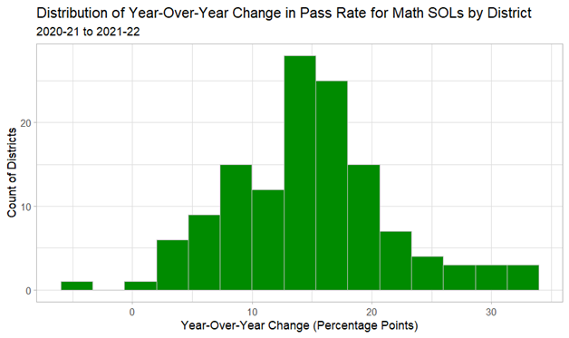

# SOL-Project 
Exploring patterns in Virginia Math SOL pass rates 2018-25
# Overview
This project seeks to examine patterns in the pass rates for mathematics Standards of Learning (SOL) tests in the Commonwealth of Virginia at both the district and school levels, using publicly available data from the Virginia Department of Education. The dataset used here spans the 2018-2019 academic year through the 2024-2025 academic year. However, no SOLs were administered during the 2019-2020 academic year due to the COVID-19 pandemic.
The dataset reports the percentage of students who passed their mathematics SOLs for the year, by school and district. Suppressed and incomplete entries (fewer than 20 observations across all years) were excluded from aggregate calculations. Year-over-year changes were calculated at both the school and district levels to identify structural shifts, recovery patterns, and variation across districts.
# Key Findings
Math SOL pass rates dropped sharply in 2020-2021 compared to 2018-2019. The median district experienced a roughly 30.7 percentage-point decline in pass rate from 2018-2019 to 2020-2021, suggesting a major system-wide disruption.
However, the following year saw a substantial recovery, with the median district’s pass rate increasing by approximately 14.9 percentage points. The decline and rebound were not uniform across the state, as year-over-year changes showed much greater dispersion in those years than in subsequent years. 
In addition, analysis of school-level trends reveals large variation within districts. Even in the most recent year available, the difference between the highest- and lowest-performing schools within some districts exceeds 60 percentage points, underscoring the importance of examining within-district performance alongside district-level aggregates. 
# Example Visualization

# Limitations
•	No student-level weighting due to lack of available counts.  
•	No subgroup or grade-level disaggregation.  
•	Analysis is merely descriptive and does not seek to establish causation.
# Data Source
[Virginia Department of Education](https://www.doe.virginia.gov/data-policy-funding/data-reports/statistics-reports/sol-test-pass-rates-other-results)
# Tools Used
•	SQLite (data cleaning, transformation, and analysis)  
•	RStudio (data visualization)
